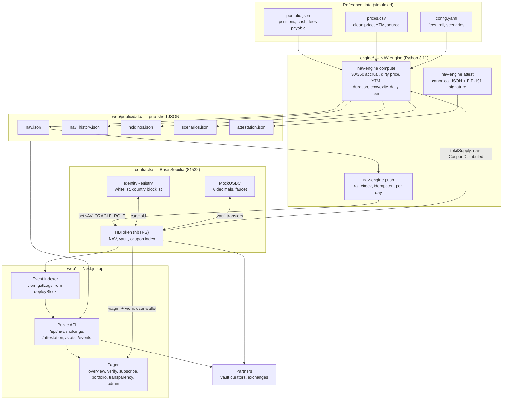
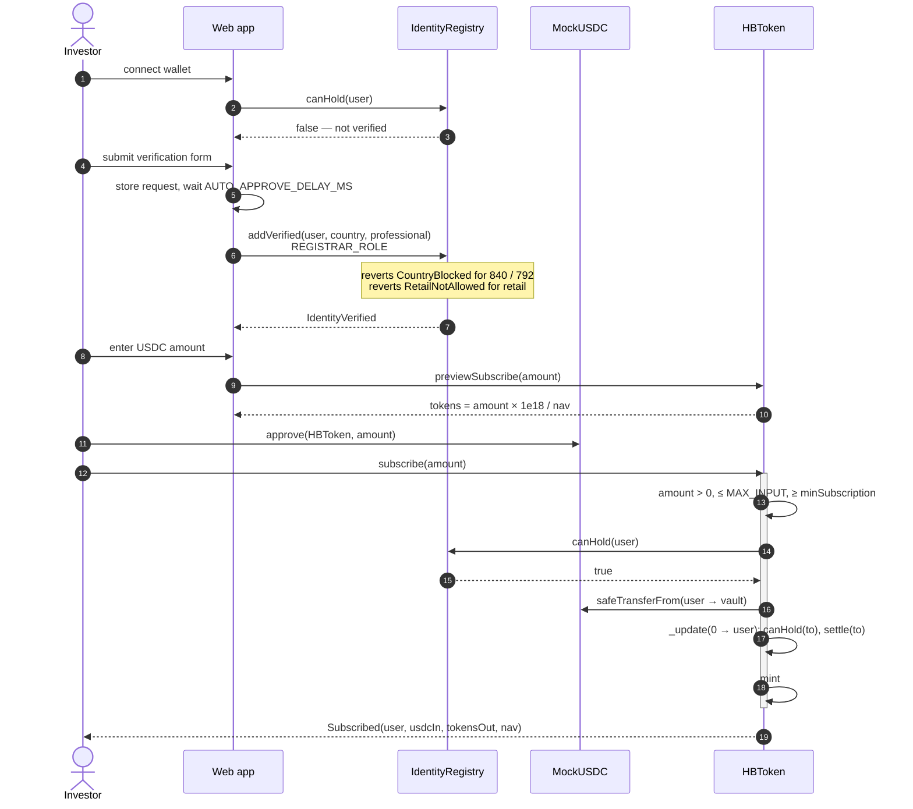
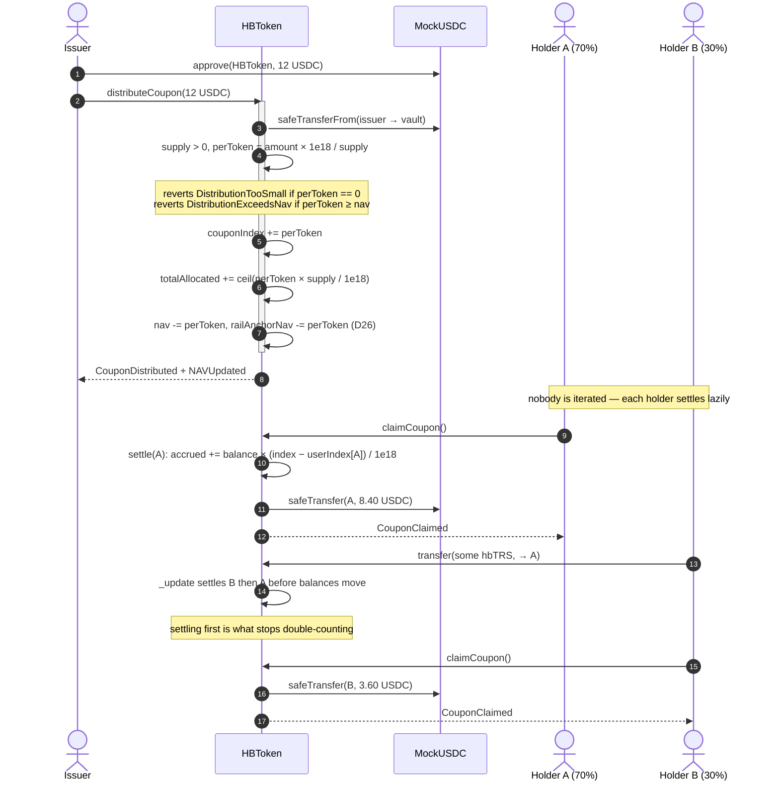
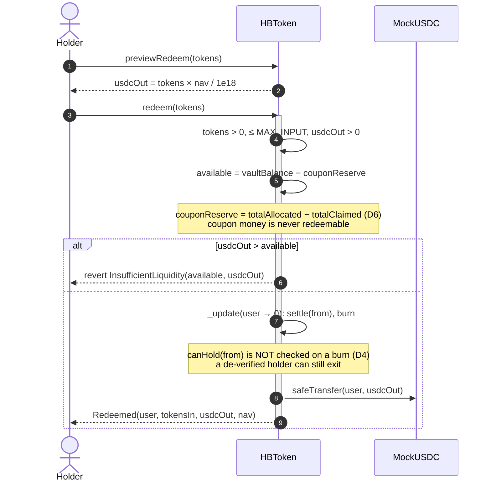

# Architecture

**Testnet demonstration on Base Sepolia. Simulated portfolio and attestation. Not an offer of securities.**

Four pieces, one direction of flow. A Python engine computes NAV from bond data, publishes it as JSON
and pushes it on-chain. Solidity contracts hold the token, the whitelist and the vault. A Next.js app
reads both and is the only thing a human touches. Partners read the same JSON and the same contract
the app does, which is the point: there is no private interface.

---

## 1. System

Two details in that diagram carry most of the design.

**The engine reads the chain and the chain reads the engine.** Token supply comes from
`totalSupply()`, and coupon distributions come from `CouponDistributed` events, both of which feed the
NAV computation. NAV then goes back on-chain through the oracle push. The loop is deliberate and it is
why the numbers on the transparency page can be checked against the contract rather than taken on
trust. When the RPC is unreachable the engine falls back to a cached supply and says so in the output.

**Partners read exactly what the app reads.** There is no partner API and no privileged endpoint. A
vault curator pricing `hbTRS` as collateral calls `nav()` on the token, the same function the
subscribe page calls, and reads `/api/nav` for the off-chain view with its assumptions attached.

---

## 2. Trust boundaries

| Boundary | What crosses it | What is checked |
|---|---|---|
| Reference data → engine | Prices and positions, maintained by hand | Every row cites a source or is labelled `illustrative` |
| Engine → chain | `setNAV` signed by the oracle key | The contract's own 5% per-24-hour rail (D27); the engine pre-checks so it does not burn gas on a revert |
| Engine → web | JSON files in the repository | Zod schemas at the API boundary; the transparency page re-checks `nav.json` against on-chain `nav()` |
| User wallet → chain | Subscribe, redeem, transfer, claim | `IdentityRegistry.canHold` on both sides of every balance change |
| Web server → chain | `addVerified` signed by the registrar key | A testnet-only key with no other role; the weakest link, and treated as such in `SECURITY.md` |
| Attestor key → published document | ECDSA signature over canonical JSON | Verifiable in the browser with viem, and in Python with eth-account |

The registrar key living on a web server is the one boundary that would not survive production
unchanged. It is called out here, in `SECURITY.md` and in `RISKS.md` rather than buried, because a
reviewer will find it in ninety seconds and the honest version is better than the discovered version.

---

## 3. Subscribe

The preview and the real call compute tokens the same way, so what the interface quotes is what
settles. A fuzz test pins that equality rather than leaving it to review.

---

## 4. Coupon distribution and claim

NAV dropping at distribution is the non-obvious step. Without it, an address could subscribe just
before a distribution, claim, and redeem at an unchanged NAV, taking the coupon from the holders who
earned it. The engine reduces reference cash by the same per-unit amount on the same day, so the
computed NAV and the on-chain NAV stay equal through a distribution.

---

## 5. Redeem

---

## 6. Where each number comes from

A reviewer checking that the numbers agree across three layers needs to know which layer owns each
one. Integers are the contract between them: the engine emits six-decimal integer USDC next to every
display string, the chain stores the same integer, and the interface formats from the integer rather
than re-deriving it from a float (D22).

| Number | Computed by | Stored on-chain | Shown by |
|---|---|---|---|
| NAV per token | Engine, from prices + cash − fees | `nav()`, pushed by the oracle | Every page; transparency re-checks the two agree |
| Reported AUM | Engine, NAV × supply | `reportedAUM`, set with NAV | Transparency |
| Token supply | Chain | `totalSupply()` | Stats, and it feeds the engine back |
| Weighted YTM, duration, convexity | Engine | not on-chain | Overview, transparency, notebook |
| Distribution yield | Engine, from `CouponDistributed` events | not on-chain | Overview |
| Pending coupon | Chain | `pendingCoupon(address)` | Portfolio |
| Available liquidity | Chain | `availableLiquidity()` | Portfolio, transparency |
| Supply-backed ratio | Chain | `supplyBackedRatio()` | Transparency |

---

## 7. Deployment and scheduling

Contracts deploy through `script/Deploy.s.sol`, which writes `contracts/deployments/<chain>.json`
holding the chain id, addresses, deploy block, transaction hashes and a timestamp. That file is the
single source of addresses: the web build generates its ABIs and addresses from it, the engine reads
it to find the token, and the event indexer reads `deployBlock` from it so it never scans from genesis.
The script refuses to run against any chain id other than Anvil or Base Sepolia.

Two scheduled paths, split on purpose by whether a key is involved:

- `nav-daily.yml` runs the engine on a cron and opens a pull request with refreshed JSON. It touches
  no key, so it can run on the default runner with nothing secret in scope.
- `oracle-push.yml` is manual only, gated behind a protected `oracle` environment, and is the only
  place a signing key enters CI.

`ci.yml` runs four jobs on every push: contracts, engine, web and a secret scan.

---

*This is a technical demonstration on a public test network. Portfolio data, prices and attestations
are simulated or illustrative and are labelled as such. Nothing here is an offer, solicitation or
recommendation to buy any security. HitBite is not a licensed financial institution.*
