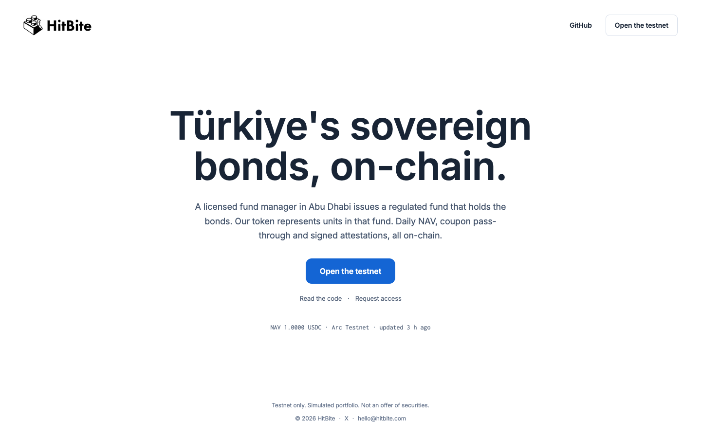
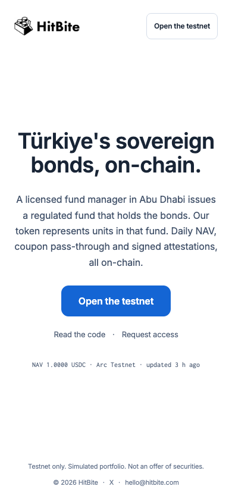

# PROGRESS.md — dated log

Founders: read the latest entry first. "Needs from founders" items block only real-testnet checkpoints; everything else runs locally on Anvil.

## 2026-09-14/15 — Session 3: Phases 1–5 complete, engine reviewed and repaired

**Did**
- Verified the tree Session 2 left uncommitted by running it, not by trusting the report: 149 forge
  tests, 100 % line/statement/branch/function coverage on `src/`, 99 pytest tests, lint clean, and a
  full `nav-engine compute`. All green, so nothing was lost when that session died.
- Committed Phase 1 (contracts) and Phase 4 (NAV engine), then built the three remaining backend
  phases and landed them:
  - **Phase 2** — 7 fuzz properties, 9 stateful invariants over a 32 768-call campaign with
    `fail_on_revert = true` and zero reverts, a committed gas snapshot, Slither with no detector
    disabled (15 findings, 0 high, all triaged), and `SECURITY.md` with an 18-row threat model that
    says plainly what is *not* mitigated. Contract tests went 149 → 161 with coverage still 100 %.
    The suite was itself validated by mutation: three deliberate bugs were injected into `HBToken`
    and each was caught.
  - **Phase 3** — `Deploy`/`Seed`/`Config` scripts, `deployments/anvil.json`, Makefile targets, and a
    founder runbook. Verified on a real fresh Anvil: deploy, then seed twice, with `cast` assertions
    on every role, both demo wallets and the blocklist.
  - **Phase 5** — oracle push with a contract-read rail pre-check, EIP-191 attestation over canonical
    JSON, key handling that cannot leak through `repr` or an exception, and the two scheduled
    workflows. Engine tests 99 → 185, six against a real Anvil.
- Ran an adversarial review of the Phase 4 engine maths, which had 99 tests but had never been
  reviewed. Six lenses raised 36 findings; each went to a refuter that had to reproduce it by running
  code, and 21 survived. All 21 are now fixed, engine tests 185 → 385.
- Wrote `ARCHITECTURE.md`, `COMPLIANCE_RULES.md`, `RISKS.md`, and the README's real-vs-simulated
  table. Recorded D30–D48 in `PLAN.md`.

**Verified end to end on a local chain (the Phase 5 checkpoint, run by hand)**
- Fresh Anvil → `make deploy-local` → `make seed` → `make push`. Every contract address and every
  creation tx hash came out byte-identical to the committed `deployments/anvil.json`; only the
  timestamp moved, so D15's determinism claim holds.
- On-chain `nav()` returned `1003061` and `nav.json`'s `nav.usdc_6dec` is `1003061`. They match, so
  the Phase 5 checkpoint passes.
- Pushing a second time did nothing, as D30 requires: *"on-chain nav already equals 1003061 and was
  set on 2026-09-14 (UTC), on or after as_of 2026-09-14."*
- The attestation was signed with a throwaway key and then verified **with Foundry's
  `cast wallet verify`**, not with the `eth_account` library that produced it, so the signature is
  confirmed by an independent implementation of the same EIP-191 scheme viem uses in the browser.
  Flipping a single digit in the signed message made verification fail, as it must.

**Phase 6 (web) — shipped and measured**
- Design system, app shell, typed data layer, five public API routes, contract sync, and the
  Overview and Transparency pages. 80 unit tests and 19 Playwright tests.
- **Lighthouse, against a production build, as D16 requires:**

  | Page | Performance | Accessibility | Best practices |
  |---|---|---|---|
  | `/` | 97 | 100 | 100 |
  | `/transparency` | 97 | 100 | 100 |

  The checkpoint is 90. No wallet code reaches either page: the whole wagmi and RainbowKit tree is
  confined to `lib/wagmi.ts`, which nothing on a public page imports.
- I ran the acceptance myself, because the acceptance agent died on a spend limit. Checked by hand:
  every Section 15 copy block is byte-for-byte verbatim; the NAV check renders "Not checked" and
  explicitly warns against reading it as a pass when no deployment is recorded; `/api/attestation`
  says no attestation has been published and names the command that would publish one; and no
  mainnet chain id or RPC appears anywhere under `web/`.
- Two defects found and fixed during that pass. `/transparency` shipped but was linked from nowhere,
  because its entry was still in the planned-routes list. And the hardened secret scan correctly
  flagged deployment tx hashes in newly generated files — they are public chain data, so the
  generator now emits the `allow-secret` marker itself rather than the marker being hand-added and
  lost on the next regeneration.

**CI green on all five jobs** (run 34911482390): contracts, Slither, engine, web, secrets.
Getting there took one fix. The secrets job failed on 21 gitleaks findings which were all the
`generic-api-key` rule matching public chain data on entropy alone — three unique values, two
Ethereum addresses and one creation transaction hash. Fixed precisely rather than by disabling the
rule: a 40-hex string is the wrong length to be a 32-byte private key, so that shape is allowed
globally and provably cannot hide one; the transaction hashes, which *are* the same length as a key,
are listed by value. Verified by planting a real-looking key and confirming gitleaks still fails.

**Phase 7 (verify, subscribe) — shipped**
- The verification store and registrar worker (D7, D8), the wallet layer, `/verify` and
  `/subscribe`. Web unit tests 80 → 292, Playwright 19 → 36. CI green on all five jobs.
- The wallet bundle stays where it belongs. Route first-load sizes: `/` 232 kB and `/transparency`
  120 kB, unchanged; `/verify` 393 kB and `/subscribe` 396 kB carry the wallet. Lighthouse on `/`
  is 93 / 100 / 100, down from 97 on performance but still above the checkpoint's 90.
- `/verify` leads with what it is not: *"This is not KYC, and nothing here checks who you are. No
  identity document is requested, read, uploaded or stored. There is no vendor behind this form, no
  reviewer, no sanctions screen and no register of people."* It then tells the reader not to type
  real personal data. The form collects no name and the route drops one if sent (D59).
- Closed a gap both page agents flagged and neither could fix: vitest's include reached only `lib/`,
  so the pure logic beside a page had no unit coverage. The subscribe quote arithmetic is now tested
  against the contract's formula written out independently, and validated by mutation — rounding the
  division up instead of down fails four of the sixteen.

**Phase 8 checkpoint proved on a live chain, at the contract level**
Ran it by hand on a private Anvil (port 8547, chosen to avoid an agent's node on 8545). Two verified
holders subscribed 7,000 and 3,000 test USDC, the issuer distributed a 12.00 USDC coupon, and both
claimed:

| | Expected | Actual |
|---|---|---|
| Holder A pending | 8.400000 | 8.400000 |
| Holder B pending | 3.600000 | 3.600000 |
| A actually received on claim | 8.400000 | 8.400000 |
| NAV after distribution | 0.998800 | 0.998800 |
| Available liquidity | 10,000.000000 | 10,000.000000 |

The 70/30 split is exact. The NAV drop is exactly the per-token coupon, which is D26 holding on a
real chain rather than only in a unit test. Available liquidity is the subscription money alone, so
the coupon reserve was correctly excluded and then correctly released once both holders had claimed.

**Attestation seam closed.** The Phase 6 transparency agent flagged that its published-attestation
branch had only ever run against a document it made up in a scratch directory, never against real
`nav-engine attest` output. Verified that seam directly: the engine's real output satisfies the web
app's *strict* zod schema (an unknown field would fail), viem — the library the browser actually
uses — verifies the published signature, and flipping one digit in the signed message is rejected.
`web/public/data/` still holds only the four committed documents; no attestation is committed (D34).

**Phase 8 (portfolio, stats, indexer) — shipped**
- The events indexer, the rebuilt `/api/events` and upgraded `/api/stats`, `/portfolio` with claim
  and redeem, and `/stats`. Web unit tests 292 → 445, Playwright 36 → 53 passing with 3 skipping on
  documented chain-state conditions.
- Lighthouse on all three public pages, against a production build:

  | Page | Performance | Accessibility | Best practices |
  |---|---|---|---|
  | `/` | 92 | 100 | 100 |
  | `/stats` | 92 | 100 | 100 |
  | `/transparency` | 93 | 100 | 100 |

  `/stats` carries charts and still holds the line; it imports nothing from the wallet layer.
- The indexer agent verified itself on a private Anvil and reported the numbers: 19 events indexed
  across 13 of 14 names, holders 2, supply folded from events matching the chain, an exact 2:1
  coupon split, and the ex-distribution NAV drop landing where D26 says it should.
- Fixed a documentation defect that agent surfaced: `PARTNER_INTEGRATION.md` and `web/README.md`
  both still described the Phase 6 placeholder endpoint — no filters, no pagination, `holders: null`.
  All of it was false by then. Both now describe the real contract, including that the cursor is a
  position rather than an offset and that `coverage` must be read before a result is trusted.

**Phases 9 and 10 — shipped**
- Phase 9: the role-gated `/admin` console, `/rules` and `/risks` rendered from the canonical root
  documents (D12), `/developers` and the OpenAPI description. Web unit tests 445 → 632, Playwright
  53 → 99 passing.
- Phase 10: the eight-step demo runner with `demo/REPORT.md`, the analytics notebook with twelve
  exported figures, and twenty screenshots covering every page in both themes.
- Lighthouse on all six public pages: 92 to 96 performance, 100 accessibility, 100 best practices.
- CI is now six jobs. The new `demo` job runs the whole eight-step scenario on a fresh Anvil **twice
  in a row** on every push — the second run is the idempotency check — and uploads the report as an
  artefact. I also added a coverage gate that fails if any contract in `src/` drops below 100%, and
  a check that `web/content/` has not drifted from the canonical root documents.

**Broke / surprised**
- I misdiagnosed a test failure and should record it. After linking the two new routes, ten
  Playwright tests failed and reverting the link made them pass, which looked conclusive. It was
  not: a server I had started by hand for the Lighthouse run was still bound to Playwright's port,
  so Playwright reused it and tested a stale build. The link was never the cause. Kill stray servers
  before trusting a bisect.
- The yield solver was quietly wrong. It stopped on an absolute 1e-14 step in yield units, which is
  smaller than the smallest representable step near maturity, so it reported failure *after*
  converging. On the shipped book it returned a silent −3.46 % yield on 2029-02-28 and then aborted
  the whole run on 2029-02-27. Re-running the old solver on 254 adversarial cases failed 44 of them
  with `ZeroDivisionError`, `OverflowError` and complex exponentiation. It is now a bracketed Newton
  with a bisection safeguard, stopping on the price residual: 8 421 cases, no round-trip failure.
- 30/360 was missing both February end-of-month rules, and accrued interest divided by a constant
  180 rather than the live coupon period. On an end-of-month schedule that let accrued exceed a full
  coupon and made NAV *fall* on a coupon date. Neither shows on the shipped book, because every
  coupon date in it is the 1st of a month — which is exactly why no test caught it.
- The engine had no notion of a bond maturing inside the valuation window: it raised on the maturity
  date and produced no NAV for that day or any later one, and face was never redeemed into cash.
  Dated 2029 on the current book, but unhandled rather than scoped out.
- `forge script --broadcast` without `--slow` writes `transactions[].hash` mis-associated — the hash
  recorded against the `HBToken` creation was actually a later `grantRole` call, confirmed against
  the node with `cast tx` and `cast receipt`. `make deploy` now passes `--slow` and re-checks every
  recorded hash against its receipt (D45).
- No published number moved through any of this. `nav_per_token` is still 1.003061 and the hand-built
  fixture still ties to the cent.

**Needs from founders** (unchanged; see `PLAN.md` Section 5)

**Next — and this is now mostly the founders' list**
Every phase 0 through 10 is built, tested and green. What remains needs credentials this machine
does not have, and is tracked in `PLAN.md` Section 5:

1. A funded Base Sepolia deployer key, so `make deploy CHAIN=base-sepolia` and `make verify` can run
   and the README's address table can be filled.
2. Demo wallets with a little testnet ETH, so `make demo` runs against the public testnet rather
   than only against Anvil.
3. A Vercel project and a WalletConnect id, for the live demo link.
4. The brand hex, two team bios, and the 90-second recording.
5. Confirmation of D19 (reference-unit NAV), D4 (de-verified holders may still redeem) and D26
   (NAV drops at distribution).

Showcase items (BUILD_PROMPT Section 14) are deliberately not started: they come only after the
definition of done passes, and item 2 of that list needs the testnet run above.

## 2026-09-14 — Session 2: Phase 1 review triage, fixes in flight, engine build started

**Did**
- Phase 1 build landed on 2026-09-08 (uncommitted until the review closes): `IdentityRegistry`, `HBToken`, `MockUSDC`, 111 unit tests, 100 % line/branch coverage on `src/`.
- The four-lens review (spec, security, coverage, arithmetic) produced 35 findings, but the refutation and fix agents died on a session limit. Triaged all 35 by hand today; 18 lead to code or test changes, 8 are Phase 2 scope, 9 are documentation.
- New decisions in `PLAN.md`: D26 (ex-distribution NAV drop closes a coupon-capture sandwich), D27 (NAV rail measured against a 24 h window anchor so in-rail updates cannot compound), D28 (uint128 input bounds, no `Panic` paths, zero-address and country-code checks), D29 (allocated vs distributed coupon accounting, `DistributionTooSmall`). D14 and D20 wording corrected. Interfaces rewritten with full NatSpec.
- Fix workflow running on `contracts/`; Phase 4 engine workflow running on `engine/` against the hand-built fixture committed on 2026-09-08.

**Broke / surprised**
- Workflow agents can hit the account session limit mid-run; the build stage had already finished, so nothing was lost, but verification had to be redone by hand.

**Needs from founders** (unchanged, plus)
5. Confirm D26: `distributeCoupon` lowers the on-chain NAV by the per-token coupon at distribution time (standard ex-distribution behaviour; BUILD_PROMPT 5.2 is silent on it).

**Next**
- Commit Phase 1 once the fix workflow's acceptance run is green; then Phase 2 (fuzz, invariants, gas snapshot, Slither, `SECURITY.md`) and Phase 3 (deploy/seed scripts, Anvil deployment JSON).

## 2026-09-08 — Session 1: planning and scaffolding

**Did**
- Read `BUILD_PROMPT.md` and `SPEC.md` in full. Copied both into the repo root (D1 in `PLAN.md`).
- Surveyed the machine: Node 25 / pnpm 10, Python 3.11 / uv, Docker, gh (logged in). Installed Foundry 1.8.1 (`foundryup`). No Slither yet.
- Wrote `PLAN.md` (phases, file paths, 24 decisions, risks, founder asks).

**Broke / surprised**
- The literal NAV formula (`NAV_total / tokens_outstanding` with a fixed 1,000,000-face book) gives a NAV of several hundred USDC per token, not 1.00. Adopted a reference-unit model (D19). Please confirm.
- No deployer / oracle / registrar keys, no Basescan key, no Vercel or WalletConnect ids are available to the agent. Every phase is verified on a local Anvil chain; the Base Sepolia steps are documented as exact commands for you to run.

**Needs from founders** (see `PLAN.md` Section 5)
1. Funded Base Sepolia deployer key (+ registrar/issuer/oracle keys or one admin key) and a Basescan API key.
2. Demo wallets A/B/C with a little Base Sepolia ETH.
3. Vercel project linked to `web/`, WalletConnect project id.
4. Confirm D19 (reference-unit NAV) and D4 (de-verified holders may still redeem).

**Phase 0 shipped (same day)**
- Foundry project (solc 0.8.26, OpenZeppelin v5.7.0 + forge-std v1.11 as submodules), `IIdentityRegistry` / `IHBToken` interfaces written up-front as the contract for Phase 1.
- Python 3.11 engine skeleton (`uv`, pandas 2.3, web3 7.16, pydantic 2.13; ruff + mypy + pytest).
- Next.js 15.5 web skeleton (TypeScript strict, Tailwind 4, vitest 4, Playwright 1.63 on a dedicated port 3457).
- Root: `Makefile` (`make lint`, `make test`, `make setup`), `.env.example` (every variable documented), `scripts/check-secrets.sh` + `.gitleaks.toml`, `ci.yml` (contracts / engine / web / secrets jobs), `nav-daily.yml` skeleton, MIT licence, CHANGELOG, CONTRIBUTING.
- Checkpoint passed: `make lint` and `make test` green locally (forge 1 test, pytest 2, vitest 6, next build, Playwright 1); CI run 34272520257 green on all four jobs (contracts, engine, web, secrets) after one fix (pnpm action needed `package_json_file: web/package.json`).

**Next**
- Phase 1: `IdentityRegistry`, `HBToken` core (restrictions, roles, NAV rail, subscribe/redeem), `MockUSDC`, unit tests covering every revert path.

## 2026-09-20 — v2 Phase 0: Arc Testnet plan awaiting approval

This entry begins v2. All preceding entries describe v1 and do not establish v2 functionality. `BUILD_PROMPT_V2.md` and `design.md` now define the requested scope; the root `PLAN.md` has a dated scope-replacement note. No application, contract, workflow, or environment implementation was changed in this phase. `STATUS.md` remains absent because only the future `pnpm e2e` may generate it.

**Work performed**

- Read both supplied attachments fully and copied them unchanged to `BUILD_PROMPT_V2.md` and `design.md`.
- Before file changes, preserved existing v1 commit `2fc8f9e75229ceca4a7347ffd089e76185030c16` as branch `v1-base-sepolia` and annotated tag `v1`; pushed both to GitHub atomically.
- Kept workspace branch `plan-and-build-from-build-prompt`. `origin/main` currently contains only `.gitkeep`; the plan proposes developing the fresh v2 tree here and integrating into `main` through review.
- Replaced the root v1 plan with the v2 plan: file tree, design mapping, interfaces, financial/decimal rules, environment contract, commands, all nine checkpoints, evidence requirements, and founder questions. The original plan and code remain at tag `v1`.
- Checked official Arc network, gas, USDC and deployment documentation. Arc documents Blockscout verification; plan includes its endpoint plus reproducible verification inputs.
- Checked the official Next.js support policy. Version 14 is listed as unsupported; the plan proposes version 16, pending founder approval.

**Verification and evidence**

- `git ls-remote origin refs/heads/v1-base-sepolia refs/tags/v1 'refs/tags/v1^{}'` confirms the branch and peeled tag both point to `2fc8f9e75229ceca4a7347ffd089e76185030c16`. The annotated tag object is `0d0d45c21f9cf2cec64c58c324bc78f6edefb680`.
- [Preserved branch](https://github.com/artuntan/hitbite-mvp/tree/v1-base-sepolia) · [Preserved tag](https://github.com/artuntan/hitbite-mvp/tree/v1).
- Input copies checked byte-for-byte against attachments; `git diff --check` used for documentation whitespace. Confirmed existing `.env*` exclusions and `.context/` exclusion before the checkpoint commit.
- No application tests or testnet transactions were run for this documentation-only checkpoint. Network documentation checks are not live deployment evidence.
- Primary sources: [Arc connection](https://docs.arc.io/arc/references/connect-to-arc), [gas](https://docs.arc.io/arc/references/gas-and-fees), [USDC](https://docs.arc.io/arc/references/contract-addresses), [verification](https://docs.arc.io/arc/tutorials/deploy-on-arc), [Next.js support](https://nextjs.org/support-policy).

**Questions for the founder**

1. Approve `PLAN.md` before Phase 1, including supported Next.js 16 in place of the requested unsupported 14.
2. NAV bootstrap: approve the disclosed supply-scaled simulated reference basket and separate actual vault reporting, or specify a fixed-capitalization model. Decision needed before Phase 4; a fixed large book divided by tiny testnet supply would create misleading per-token NAV.
3. Revoked holders: approve redemption and earned-coupon claims for existing holdings while receiving/transferring tokens stays prohibited, subject to pause. Decision needed before Phase 2.

**Design gaps and conservative defaults**

- No proprietary fonts or HitBite screen mockups supplied. Plan uses the design's permitted Inter/Inconsolata substitutes and the brief's screen structure.
- No explicit stepper widths, mobile flow layout, control states, focus treatment, select/checkbox/toggle, chart styling, or wallet-modal specification. Plan uses native controls, supplied tokens, white/hairline cards, near-black actions, and records any implementation deviation at its checkpoint.
- Client-side signature verification is Core because the product specification and definition of done require it, despite its duplicate Excellence listing. Chain configuration is also Core; an actual fallback deployment remains Excellence.

**Known gaps and next checkpoint**

- V2 is planned only. Existing v1 files remain until the approved repository phase. `STATUS.md` contains no v2 claims because it does not yet exist.
- Credentials, hosted verification store, faucet funding, WalletConnect and Vercel access remain unestablished; the plan lists when each becomes necessary. No secrets were inspected or printed.
- Next: founder approval, then Phase 1 (repo and safety). Do not advance before approval; commit and push this planning checkpoint first.

## 2026-09-20 — v2 Phase 1: repository and safety checkpoint

**Approval received**

- The founder approved Phase 0 and its proposed decisions: Next.js 16, the disclosed supply-scaled NAV model, and revoked holders being allowed to redeem/claim existing entitlements while unpaused. Later phases retain their individual approval gates.

**Work performed**

- Reconfirmed the remote v1 branch/tag at `2fc8f9e75229ceca4a7347ffd089e76185030c16`. Replaced the v1 working tree with the v2 scaffold on the unchanged workspace branch. Preserved ignored v1 artifacts and local caches in `.context/v1-worktree/`; no history was reset or rewritten.
- Created the pnpm workspace with `app/`, `packages/config/`, `contracts/`, `nav_engine/`, `scripts/`, `tests/`, and `deployments/`. Kept the MIT licence and exact pinned OpenZeppelin 5.7.0/forge-std 1.11.0 submodule commits. No v1 contract or application implementation is active in the new tree.
- Added a minimal Next.js 16.3.5/React 19.3.0/Tailwind 4.3.3 shell with the exact testnet banner/footer, strict TypeScript, root commands, and a committed pnpm lockfile. This is not the investor app or final screen design.
- Centralized the three permitted networks, Arc USDC address/decimal constants, chain-ID guard, validated public environment fields, exact copy blocks, and the production mapping. Production-chain selections, prototype-property names and mismatched RPC chain IDs fail closed.
- Replaced `.env.example` with commented current/future settings and empty credentials; expanded ignore rules for the new app and local database. Added redacted candidate-tree checks with gitleaks and a regression check for untracked secrets/forced tracked env files. The scanner never prints matched values and does not scan ignored local environments or preserved v1 history.
- Replaced v1 workflows with Phase 1 CI for workspace checks, Foundry scaffolding, and secret checks. Foundry has no contract sources yet; CI describes this explicitly. NAV jobs/dry-runs arrive in Phase 4 rather than returning a fake success now.
- Rewrote README as a scaffold guide with exact available commands, the unchanged production mapping, preserved-v1 links, and the future generated STATUS link. `STATUS.md` remains absent.

**Verification**

- `pnpm install --frozen-lockfile`: lockfile installation succeeds.
- `pnpm check`: ESLint, TypeScript/Next route types, eight configuration/security checks, and optimized Next build pass locally. Lint warnings were corrected and now fail the lint command.
- Production server: HTTP 200 with the exact banner and footer; under-construction content rendered. The temporary server was stopped after verification.
- `forge fmt --check --root contracts` / `forge build --root contracts`: empty scaffold recognized (nothing to format/compile), not a claim of contract test coverage.
- `python3 scripts/check-secrets.py --gitleaks`: candidate files pass with no findings. `git diff --check` and ignored-path checks pass.
- Remote CI evidence will be appended after the pushed implementation commit runs.

**Implementation findings and limits**

- Next.js's current React/import/accessibility lint plugins reject ESLint 10 and one crashes at runtime. Pinned ESLint 9.39.5 for compatibility; it emits an upstream deprecation warning. This is development tooling, and the limitation remains recorded for upgrade when the plugins support 10.
- Auditing the unused wagmi/RainbowKit dependency tree found known ws, uuid and decode-uri-component advisories. Deferred wallet packages until their consuming Phase 5 implementation, when SDK compatibility and audit remediation can be verified together. Phase 1 retains only dependencies used by the scaffold; wallet integration is not claimed.
- Gitleaks initially misread adjacent empty wallet-key assignments as a credential. Added a descriptive comment between those entries; no secret-detection exemption was introduced.
- System-font fallback and the plain shell are temporary Phase 1 design defaults; approved self-hosted Inter/Inconsolata and product components remain Phase 5 work.
- No contracts, NAV computation, wallets, real transactions, or deployment were implemented in this checkpoint.

**Questions for the founder / next**

- Once the CI evidence is recorded, approve Phase 2 to implement and test the contracts. No additional product decision is required for that phase.

**Additional Phase 1 verification before push**

- Re-ran `pnpm check` after the final dependency changes: zero lint warnings, eight passing checks, successful typecheck and production build.
- `pnpm audit --prod`: zero reported vulnerabilities across the remaining scaffold production dependency tree. This is the package advisory result, not a security audit of the future product.
- Confirmed the CI-pinned gitleaks checksum release asset exists. Both supplied source files remain byte-identical to the attachments; `STATUS.md` is still absent.

**Remote Phase 1 checkpoint**

- Implementation commit `9186ac8339680ba89f24dd4a243f2b38050e9222` is pushed. [CI run 35500104125](https://github.com/artuntan/hitbite-mvp/actions/runs/35500104125) passed all three jobs (workspace, Foundry scaffold, candidate-tree secret checks).
- Founder steering received after this checkpoint: continue until the platform is complete without stopping for phase approvals, and minimize interim explanations. This supersedes the earlier per-phase approval stops; evidence, incremental commits and truthful status reporting remain required.

## 2026-09-20 — v2 Phase 2: contracts checkpoint

- Implemented the v2 registry, 18-decimal hbTRS, and local/Base Sepolia-only MockUSDC. Implemented current eligibility checks, initial US/TR blocklist, issuer/oracle roles, exact v2 NAV events/rail, subscribe/redeem math, pause, and externally funded coupon-index accounting with preserved fractional accrual and reserved liquidity.
- Added the allowlisted Foundry deployment script; the receipt-validating wrapper in Phase 3 will publish deployment JSON only after broadcast confirmation.
- `forge test --root contracts`: 26 unit/fuzz tests plus the stateful invariant suite passed. Each fuzz test ran 512 inputs; invariant campaign ran 128 sequences / 8,192 calls with no reverts, checking funded coupon reserves, conservation and supply.
- `forge coverage --root contracts --no-match-test invariant`: HBToken 100% lines (111/111), 99.27% statements, 95% branches; registry and MockUSDC 100% lines/statements/branches. Deployment and invariant handler code are excluded from these source coverage claims; raw report is `.context/phase2-coverage.txt`.
- Corrected an invariant-test setup issue where reading the balance consumed a one-shot prank before transfer; no protocol change was needed. Fuzz round trips require a positive redemption output and assert loss of at most one micro-USDC.
- Added actual contract tests to CI. Runtime configuration assertions remain active. No deployment or live-product claim is made by this contract checkpoint.
- Confirmed the founder's faucet transfers: deployer and both independent E2E wallets each have 20 testnet USDC on chain 5042002. Vercel CLI login is available. Private values remain only in ignored `.env` (mode 0600); no private keys are in code or logs.
- Continuing into Arc deployment under the founder's instruction to finish all phases without further approval stops.

## 2026-09-20 — v2 Phase 3: live Arc deployment

- Phase 2 remote CI passed: https://github.com/artuntan/hitbite-mvp/actions/runs/35500747439.
- Deployed and verified [IdentityRegistry](https://explorer.testnet.arc.io/address/0xd8c5d0473d11de3177a68182b91213171d8e4580) and [HBToken](https://explorer.testnet.arc.io/address/0x6d5163d237203af9bce4292562b94e585327927e) at block 63061198. Deployment JSON contains confirmed receipts, public roles, metadata and standard JSON verification inputs.
- Funded the vault with 10 testnet USDC, transaction `0x5913c75485f933148be3eb6ac70d0216f58957b978e6a1deddfe97cd17baeb4f`, block 63061404. Issuer, oracle and registrar have separate funded signers.
- A real cast-published approval and 0.5-USDC subscription succeeded from the deployer. Subscribe receipt: [0x3de203616b66433d30d9583d59d72b68ea97c72ce2b5ceccd95ae369a772305e](https://explorer.testnet.arc.io/tx/0x3de203616b66433d30d9583d59d72b68ea97c72ce2b5ceccd95ae369a772305e), block 63061601. Both funded E2E wallets remain fresh for the final live runner.
- The installed cast version does not read ETH_PRIVATE_KEY. `scripts/cast-subscribe.ts` therefore uses cast calldata, viem signing from env/memory, then cast publish with the public signed transaction. No key enters argv. The command is `pnpm exec tsx scripts/cast-subscribe.ts`.
- `pnpm run deploy` is required because `pnpm deploy` is a built-in workspace command. The Foundry wrapper publishes artifacts only after receipt/code checks. Standard Foundry works with Arc; no custom fork was needed.
- Local script lint and type checks pass. On-chain actions use a minimum 20-gwei max fee. Continuing to NAV and the application; STATUS remains reserved for the live E2E generator.

## 2026-09-20 — v2 Phase 4: NAV and attestation

- Added the three-file Decimal-based Python engine, pinned Python 3.11 runtime dependencies, explicit simulated portfolio/quote provenance, semiannual ACT/ACT accrued interest, numerical YTM, retained simulated coupon cash, and Actual/365 fee accrual (0.75% management + 0.30% expenses on reference units). Dates are model assumptions, not real bond identifiers or schedules. Manual quotes visibly carry forward; no market-data freshness claim is made.
- NAV uses the approved fixed-reference basket scaled to the actual on-chain supply. Vault cash and reserved coupon cash are reported separately and never added to simulated assets. Zero supply is explicitly labelled bootstrap with no backing ratio. The trailing distribution yield uses actual funded coupon-index increments in the last 30 days and is not annualized.
- Ten deterministic math tests pass, including par YTM, dirty-price day count, premium pricing, supply scaling, six-decimal flooring, fees, coupon-date continuity, zero supply, maturity rejection and as-of prices. Ruff passes. A dry-run reads no RPC or signer and never overwrites live artifacts.
- Live NAV is 1.000000 USDC per token and equals the on-chain value after [publication](https://explorer.testnet.arc.io/tx/0xf7df957f0f2141faea1f30fd2796619a04484471007c4daa1e3332e88461f1cf). Signed snapshot records the exact publication block, holdings, vault and supply. EIP-191 signature recovered independently with eth-account. Public attestor: `0x60Be08C7e2dA3b9C1fe2955d237b8833C2D63254`.
- Added daily 07:00 UTC NAV → push → attest workflow with concurrency protection and confirmed JSON commits, plus CI Python tests/lint/dry-run. GitHub oracle/attestor secrets and public signer variable were configured through stdin; no values were printed. Scheduled execution starts when the workflow reaches the default branch.
- References for implementation: [web3.py transaction API](https://web3py.readthedocs.io/en/stable/web3.eth.html), [eth-account EIP-191](https://eth-account.readthedocs.io/en/stable/eth_account.html), and [TreasuryDirect semiannual accrued-interest formulas](https://www.treasurydirect.gov/files/laws-and-regulations/auction-regulations-uoc/31-cfr-part-356.pdf). The latter informs the declared simulation convention only.
- Gitleaks exemptions are limited to public 20-byte addresses and structurally identified public deployment transaction hashes; signing keys remain prohibited. Continuing directly into the app.

## 2026-09-20 — v2 Phase 5: guided app and verification

- Implemented the five-step investor flow with live Arc reads, explicit approval/subscription stages, eligibility review, positions, coupon claims, redemption previews and liquidity guards. Every contract write shows its explanation, signing control and confirmed receipt/events. Transaction fees retain Arc's 20-gwei floor and subscriptions leave a small gas balance.
- Implemented the four product routes, shared walkthrough toggle, responsive layout, on-chain event activity, and gated operator controls. Overview/Transparency bind to the same contract and published JSON; additional live-browser verification follows in Phase 6.
- The verification API requires an authenticated short-lived challenge, correct origin/chain, professional consent, country validation, wallet signature and a server-enforced ten-second review. The live blocklist and immutable historical country record prevent revoked wallets from self-registering. Names are hashed, not retained or put on-chain. The dated PLAN amendment documents replacing the proposed external database with on-chain canonical state and signed tickets.
- Twelve configuration/security tests pass, including early-review, expiry, tampering, origin/chain, country/consent and attestation trust-anchor checks. `pnpm check` passes lint, types, tests and production build. All four routes load in Chromium with no page errors; desktop 1440px and mobile 390px have no document overflow. Screenshots: `.context/overview.png`, `.context/flow-connect.png`, `.context/flow-mobile.png`, `.context/transparency.png`, `.context/admin-locked.png`.
- Design uses the supplied white canvas, near-black actions, 4px/8px geometry, restrained 400–600 weights, generous spacing and approved self-hosted Inter/Inconsolata substitutes. Their OFL licences ship in the font packages. The mobile stepper becomes a compact row above the active card, with the position below.
- Wallet dependencies required narrow advisory overrides (ws, uuid, decode-uri-component and React-compatible use-sync-external-store) and Coinbase's optional x402 peers to satisfy Next's SSR bundler. Production dependency audit now reports zero advisories. Injected wallet behavior is exercised next; WalletConnect remains optional and requires a public project ID. Upstream deprecated SDK packages remain recorded rather than represented as independently audited.
- Created a new isolated Vercel project `hitbite-testnet-v2`; existing projects were not modified. Only registrar/review server secrets and required public configuration were provisioned. Deployer, issuer, oracle, attestor and E2E private keys were not sent to Vercel.
- Remote Phase 3 and Phase 4 CI passed, including [NAV checkpoint CI](https://github.com/artuntan/hitbite-mvp/actions/runs/35501533677). No founder walkthrough is claimed; live E2E and generated STATUS are still pending.

## 2026-09-20 — v2 Phase 6: live application verification

- Published the isolated app at https://hitbite-testnet-v2.vercel.app. All four routes return HTTP 200; read-only smoke checks confirm contract code, the single six-decimal settlement asset, required country blocks, fresh NAV agreement and the attestor trust anchor.
- An independently funded UI wallet completed the actual live-site flow through an injected Playwright wallet bridge: connect, US-country rejection, signed review, approve, subscribe, funded issuer coupon distribution, claim and full redemption. The signer stays in Node and the browser receives no private key. Signature verification, remembered walkthrough and mobile layout also passed without browser runtime errors. This automated result is explicitly not founder acceptance.
- Screenshots of all five steps: `.context/step-1-connect.png`, `.context/step-2-review.png`, `.context/step-2-verified.png`, `.context/step-3-subscribe.png`, `.context/step-4-hold.png`, `.context/step-5-redeem.png`. Additional evidence: `.context/transparency-verified.png`, `.context/admin-issuer.png`, `.context/flow-mobile-verified.png`.
- Corrected test-harness issues: tsx's function-name helper cannot be serialized into an init script, so the provider bootstrap is literal browser JavaScript; Next's route announcer requires scoped alert/status selectors. These were test-driver errors, not claimed as failed contract transactions.
- Hardened displayed attestation public-key checking against the expected signer, retained exact BigInt formatting for large balances, corrected the mobile stepper's final item and walkthrough-switch CSS, and labelled the snapshot publication link accurately. Added a small funded-wallet prerequisite to the simulated review to discourage free unfunded-address spam.
- Scanned all 201 generated client static files for configured signing/review secrets: none found. Phase 5 remote [CI](https://github.com/artuntan/hitbite-mvp/actions/runs/35502410934) passed. Production dependency audit reports no known advisories; no independent security audit is claimed.
- Added the live E2E/STATUS generator and read-only smoke runner. E2E validates recent browser evidence and exact-source CI before spending from the two fresh investor wallets; those two remain reserved for the final acceptance run.

### Phase 6 reliability follow-up

- Multiple simultaneous operator browser contexts reached Arc's public RPC rate limit. Confirmed the token was already unpaused using the independent dRPC Arc endpoint; no funds or eligibility were lost.
- Consolidated browser contract reads with deployless multicall at a pinned block and HTTP batching, added the documented public Arc fallback endpoints, and reduced periodic polling. A real Arc position snapshot passes using the combined reads. Explicit custom RPCs are kept isolated and never silently fall back to public endpoints.
- Operator browser tests close completed role contexts instead of continuing background polling. Registrar verification/revocation and oracle publication had confirmed before the read-rate failure; issuer pause/unpause also completed on-chain, with the UI refresh verification to be rerun after the fix.
- Connected only the new Vercel project to the repository and configured a dedicated main-branch deploy hook as a GitHub secret. The daily NAV job now triggers deployment and checks that the public site serves the exact newly published NAV receipt. This is needed because workflow-generated data commits must reliably reach the live site.

### Founder acceptance — 2026-09-20

- The founder explicitly answered “Evet, akışın tamamını denedim” to the live-app fresh-wallet verification → subscription → coupon claim → redemption acceptance question. This is recorded separately from the automated wallet bridge. The E2E generator will publish the confirmation with its provenance; STATUS is not edited by hand.
- Tightened repeated browser tests to wait for the current action's receipt, not an older event in the activity log, and gave the injected test wallet a nonce manager. This prevents a repeated-run test from navigating away while a claim is pending and racing a redemption with the same nonce.
- Bound the displayed verification result to the complete current attestation payload/signature/public key and expected NAV, so a background snapshot refresh requires verification again. Confirmed balances bypass the block-number cache after transactions.

## 2026-09-20 — v2 Phase 7: generated acceptance evidence

- `pnpm e2e` completed at 2026-09-20T10:05:42.633Z: all 24 checks passed against the public Arc app. `STATUS.md` was generated by that command only and every Core feature is green. Public transaction hashes, blocks and decoded events are recorded in `deployments/evidence/e2e.json`.
- Both independent fresh wallets completed the signed ten-second review, exact 1-USDC approval/subscription, funded coupon claim and full redemption. Token balances returned to zero. US/TR restrictions, unverified-recipient rejection and paused-subscription rejection passed; the issuer restored the token to unpaused operation.
- Exact-source CI passed: https://github.com/artuntan/hitbite-mvp/actions/runs/35503845488. The final browser run passed seven checks without page errors. Separate operator browser evidence covers registrar add/revoke, oracle NAV publication and issuer pause/unpause. The original fresh-wallet browser verification is preserved alongside the repeat-run evidence.
- A live browser negative check verified that refreshing to a changed attestation clears the previous verified state and rejects a tampered payload. This read-only check performed no contract writes.
- Founder acceptance is explicitly confirmed and published with its actual statement/provenance. It remains separate from automated browser evidence.

## 2026-09-20 — v2 Phase 8: handover and default branch

- Completed the README with faucet/network instructions, investor flow, exact deployment addresses, architecture and production responsibility mapping, simulation assumptions, role operations, daily NAV/deployment configuration and reproducible acceptance prerequisites. The founder has confirmed the live flow.
- Final merge and an actual dispatch of the default-branch daily NAV job follow this checkpoint. Their results will be appended after execution; scheduling alone is not claimed as delivery proof.

### Default-branch NAV delivery check

- PR #1 merged after all CI and Vercel checks passed: https://github.com/artuntan/hitbite-mvp/pull/1. The workspace branch name is unchanged.
- The first dispatched daily workflow successfully computed NAV, confirmed the oracle transaction, signed the snapshot and committed its JSON. Its final delivery check rejected Vercel's successful HTTP 201 (Created) response because it accepted only HTTP 200. A direct hook check confirmed HTTP 201 with a pending deployment; the deployment request itself succeeded.
- Corrected the delivery checker to accept successful 2xx responses, while retaining its required comparison of the live publication transaction with the newly confirmed snapshot. No signer, valuation or contract code changed. The full daily workflow is being rerun to verify the correction.

### Final delivery evidence — 2026-09-20

- The complete daily NAV workflow passed: https://github.com/artuntan/hitbite-mvp/actions/runs/35504318935. It confirmed [the oracle publication](https://explorer.testnet.arc.io/tx/0x2c20519a0b0c8884f039c0c247ff0773edca6b1b4ed78fed2a3f40435b29fde2), signed and committed the snapshot, requested the production deployment and verified that the live site served the identical publication hash. The 07:00 UTC schedule is on `main`; its first end-to-end dispatch is proven.
- The public app serves NAV 1 USDC with a valid client-side signature. Final read-only browser checks passed for Overview, the refreshed Transparency signature and mobile layout with zero page errors. Evidence is `deployments/evidence/nav-delivery.json`; screenshots are `.context/final-overview.png`, `.context/final-transparency.png` and `.context/final-mobile.png`.
- Final `pnpm smoke` passed all seven checks against the public site. CI for the delivery correction passed on both main and the workspace branch: https://github.com/artuntan/hitbite-mvp/actions/runs/35504318902 and https://github.com/artuntan/hitbite-mvp/actions/runs/35504318709.
- v1 branch and peeled tag still point to `2fc8f9e75229ceca4a7347ffd089e76185030c16`. All platform code, generated acceptance receipts, deployment data and operating instructions are on main. The temporary local server was stopped; the live site continues independently on Vercel.
- Core handover is complete, including the founder's confirmation. Remaining optional scope is recorded in the generated STATUS: monthly coupon automation, Base Sepolia deployment and WalletConnect QR pairing are not claimed. Repository visibility remains private; the live app is public.

## 2026-09-20 — Founder feedback: focused investor experience

- Replaced Overview with the investor flow at `/`; `/app` remains compatible. The header now contains only the HitBite brand, Transparency and a live position summary. Its translucent, blurred surface stays fixed during scrolling; balances, verification, wallet controls and authorized operator access open in a native, dismissible popover.
- Replaced the three-column application and large introductory copy with one focused card and a compact five-step navigator. Moved help to the footer, made activity and price/fee details expandable, removed empty receipt placeholders and contract-function labels from the default investor view. Subscription now presents approval and subscription sequentially; confirmed subscription/redemption receive explicit completion screens. Explanations and receipt links remain available.
- Changed step state to initialize per connected wallet and remain stable during balance refreshes, so a confirmed transaction can finish displaying its result. The header position shares the same live query. Existing contract calls, eligibility/review rules, gas reserve, exact approval amounts and liquidity guards are preserved.
- Local browser checks passed at 1440, 768, 390 and 320px: no document/header/popover overflow; fixed glass header during scrolling; Escape/outside-click dismissal and focus return; root and `/app` entry; fresh-wallet verification form and blocked US selection; Transparency signature verification. The layout test makes no transactions.
- Local injected-wallet browser flow passed all seven checks with real Arc receipts: subscription, issuer-funded coupon and investor claim, full redemption, app/Transparency/chain NAV agreement, signature verification and remembered help/mobile layout. Test-only screenshots use unchanged caret styling to avoid Playwright injecting attributes before React hydration.
- `pnpm check` passed ESLint, types, all 12 configuration/security checks and the optimized production build. Candidate-tree gitleaks passed. Next dev generated its version-specific `app/AGENTS.md` / `CLAUDE.md`; these are retained, and the relevant bundled Next layout/client-boundary/accessibility guides were read.
- The dated PLAN amendment records the founder's design changes. Historical generated STATUS is preserved without hand edits; the E2E generator now names the replacement App entry check. Live revision evidence will be added after production delivery.

### UX revision: production verification

- PR #2 merged after all CI and Vercel checks passed: https://github.com/artuntan/hitbite-mvp/pull/2. Production is updated at https://hitbite-testnet-v2.vercel.app; the workspace branch name is unchanged. Main CI passed: https://github.com/artuntan/hitbite-mvp/actions/runs/35505763545.
- The published app passed all seven transaction/browser checks and all six layout/navigation groups. This includes real 0.2-USDC subscription, issuer coupon distribution/claim, full redemption, explicit redemption-completion screen with the header position refreshed to 0.00 USDC, NAV consistency, client-side attestation, mobile layout and remembered explanations. Public receipts and the exact revision are in `deployments/evidence/ux-revision.json`.
- The separate read-only suite verifies direct root entry, backward-compatible `/app`, the minimal navigation, fixed blur header during scrolling, four viewport widths (320–1440px), native popover dismissal/focus and the unverified-wallet form/country restriction. No browser runtime or hydration errors were recorded in the live flow.
- Final screenshots are under `.context/ux-1440.png`, `.context/ux-390.png`, `.context/ux-verify-mobile.png`, `.context/ux-glass-scroll.png` and `.context/step-5-redeem.png`. Founder acceptance from the earlier implementation remains a historical record; no new manual acceptance is claimed for this visual revision.

## 2026-09-20 — Founder refinement: scroll glass and investment workspace

- The fixed header has no bar background at the top. Its separate glass surface fades in proportionally between 8 and 80px of scroll, with a short easing transition; returning to the top clears it. Passive, animation-frame scroll updates avoid rendering React on every scroll. Reduced-motion preferences disable the transition.
- Replaced the five clickable steps with a three-stage setup indicator and only the currently required form. Registry confirmation closes verification automatically. Confirmed holdings open the Portfolio workspace with actual wallet/position/coupon balances, NAV publication time, vault liquidity, subscription/redemption tabs and confirmed wallet activity with amounts/explorer links.
- The workspace remains open after full redemption and reload in the same browser. Its preference is scoped to wallet, chain and contract; an unrelated wallet's preference does not skip setup. Positive on-chain holdings/coupons independently open the workspace. No financial permissions depend on browser storage.
- Retained the existing palette, typography, rounded surfaces and simulation disclosures. Preserved exact approval amounts, USDC gas reserve, registry eligibility, pause/liquidity guards, coupon access after redemption and confirmed receipts. Amount fields/order tabs lock during a pending order; new workspace orders start with an empty amount.
- Local browser checks passed top/intermediate/scrolled header states, fixed positioning, return-to-top transparency, reduced motion, popover keyboard focus/dismissal and four widths (320, 390, 768, 1440). The real funded-wallet flow passed automatic workspace entry, reload persistence, coupon distribution/claim and full redemption with the empty workspace preserved. The changed pending-order controls are being checked again before delivery.
- A fresh ephemeral wallet received 0.06 test USDC for the existing verification minimum, signed the real review and automatically advanced to subscription after its registrar receipt. The first unfunded test correctly received the API's minimum-balance rejection; funding the test fixture allowed the transition check to pass. No eligibility validation was weakened. Local seven-group layout evidence is in `.context/ux-layout-evidence.json`.
- Updated PLAN with the founder's refinement and README with the current setup/workspace behavior. STATUS remains the untouched historical E2E report. This revision will receive separate live evidence after deployment.
- `pnpm check` passed lint, types, all 12 configuration/security tests and the optimized production build; candidate-tree gitleaks found no leaks. A development hot reload during the second browser run remounted the coupon panel after an on-chain claim and cleared its transient receipt, so the test timed out rather than making a false assertion from activity text. Final transaction checks now run against `next start` with source changes frozen.

### Workspace refinement: production verification

- PR #3 merged after every CI and Vercel check passed: https://github.com/artuntan/hitbite-mvp/pull/3. Implementation commit `78120d7`, production merge `6cb98df`. Main CI passed: https://github.com/artuntan/hitbite-mvp/actions/runs/35507723092.
- The optimized local build and the deployed app each passed all eight browser-flow checks. Live transactions covered exact 0.2-USDC approval/subscription, automatic workspace entry, issuer coupon funding and investor claim, full redemption with the account remaining open after reload, NAV consistency and client-side attestation verification. Pending amount fields/order tabs lock and unlock as expected. No runtime/hydration errors were recorded.
- The public app passed all six layout/navigation groups: transparent header at the top, proportional glass reveal while scrolling, fixed coordinates, clearing again at the top, reduced motion, popover dismissal/focus, direct root and `/app` entry, blocked-country form and 320/390/768/1440px layouts. `pnpm smoke` also passed all seven read-only chain/data/route checks.
- Public transaction receipts, live browser results and the separately labelled local fresh-wallet verification proof are committed in `deployments/evidence/workspace-ux.json`. Historical generated STATUS and founder acceptance are unchanged.
- Final live screenshots are `.context/portfolio-1440.png`, `.context/portfolio-390.png`, `.context/ux-1440.png`, `.context/ux-390.png` and `.context/ux-glass-scroll.png`. The final order form starts empty, preserves exact approval wording for valid amounts and keeps automatic heading focus visually unobtrusive. The local server is stopped; the app runs independently on Vercel.

## 2026-09-20 — Founder refinement: Transparency workspace

- Rebuilt Transparency around the approved portfolio layout: compact heading, three live metrics, published NAV history, signed snapshot, simulated holdings, a real vault breakdown and explorer/copy controls for contracts. Applied the same restrained olive palette, numeric typography and rounded surfaces. Added a route-specific title and stylesheet without changing investor transaction logic.
- Moved valuation inputs, fees, simulated yields and the eight-row production model into labelled disclosures. Snapshot holdings state their publication supply/date; live supply and spendable vault cash remain separate. Small text contrast was increased while preserving the visual language. Mobile holdings keep instrument, allocation and value visible; coupon/maturity remain in the expandable valuation inputs.
- Replaced the old sparse chart with exact published observations, date/value/block readout, pointer and keyboard selection, previous/next controls and an inspectable table. One observation renders as one point, and empty/flat series are handled without fabricated history.
- Retained the attestation trust-anchor, chain/contract, payload/public-key and NAV checks. Signature verification is immediately available; a changed or unavailable snapshot invalidates the prior verified display. Exposed original NAV/attestation downloads, public JSON and explorer links; contract addresses can be copied without a wallet.
- The dedicated read-only browser suite passed seven groups against the local app: real published NAV/holdings and signature, source-equivalent downloads, clipboard/explorer controls, 320/390/768/1024/1440px layouts, expanded-detail overflow, all production rows, keyboard/flat/empty history, refresh invalidation, tampered-payload rejection, data-fetch failure/retry and client navigation/help. Synthetic cases use browser interception only; neither published data nor contracts are modified. No runtime/hydration errors or transactions were recorded.
- PLAN now records this scope amendment. Historical generated STATUS and earlier acceptance evidence remain unchanged. Production-build and live read-only verification follow before handover.
- `pnpm check` passed ESLint, types, all 12 configuration/attestation/security tests and the optimized production build; gitleaks passed. The new `pnpm test:transparency` suite also passed all seven groups under `next start`, confirming production CSS ordering and navigation. The existing read-only shell suite passed all six groups, including transparent/scrolled header, position popover and app entry. Transaction tests were not rerun for this read-only page change; their NAV selector was updated to the stable Transparency test ID.

### Transparency refinement: production verification

- PR #4 merged after all CI/Vercel checks passed: https://github.com/artuntan/hitbite-mvp/pull/4. Implementation `e719ac0`; production merge `00393b8`. The redesigned page is live at https://hitbite-testnet-v2.vercel.app/transparency.
- All seven dedicated Transparency browser groups passed against the public deployment, with no runtime or hydration errors. Real source signatures verified, downloads matched the published JSON and contract clipboard/explorer controls worked. Browser-only fixtures confirmed changed-snapshot invalidation, NAV-mismatch warnings, tampered-payload rejection, failed-fetch recovery and exact keyboard/flat/empty history behavior.
- All six read-only shell regression groups passed on the deployed site, preserving direct app entry, the transparent/scrolling glass header, popover focus/dismissal, mobile layouts and the new-wallet eligibility form. `pnpm smoke` passed all seven chain/data/route checks. No transactions were sent; original contracts and generated STATUS were not changed.
- Public evidence is `deployments/evidence/transparency-ux.json`. Final screenshots are `.context/transparency-1440.png`, `.context/transparency-390.png` and `.context/transparency-verified.png`. Local development/production servers are stopped; deployment runs independently on Vercel.

## 2026-09-20 — Founder-supplied brand asset

- Replaced the placeholder header mark/text with the supplied transparent 512 × 151 AVIF, served unchanged at `/brand/hitbite.avif`. Preserved the original proportions, accessible app link and 44px minimum link target. Desktop width is 140px; mobile scales between 82 and 110px.
- Adjusted the narrow mobile header so the complete wordmark, Transparency link and position summary remain visible together. Position text stays on one line; the optional chevron hides on the narrowest screens. Scroll glass behavior is unchanged.
- Initial production build, lint, types and 12 configuration/security tests passed. The existing six-group read-only shell suite passed; visual review prompted a final small mobile spacing correction before final verification.
- Final optimized build and all six existing read-only shell checks passed after the spacing adjustment. Browser inspection at eight widths (320–1440px, including breakpoint edges) confirmed the original image decodes, is byte-identical to the attachment, keeps its aspect ratio and never overlaps navigation. Position controls retain their intended height, the home target remains at least 44px, and no runtime errors were recorded. Gitleaks passed.

### Brand asset: production verification

- PR #5 merged after all CI and Vercel checks passed: https://github.com/artuntan/hitbite-mvp/pull/5. Implementation `b357dea`, production merge `738ae3d`. The actual logo is live throughout the shared app header.
- Public browser inspection passed all eight widths (320–1440px), original asset byte comparison/decoding, preserved proportions, non-overlapping navigation and the 44px home target. All six existing shell checks also passed against Vercel, including scroll glass, position popover/focus, route entry, attestation verification and eligibility form behavior. No runtime errors or transactions were recorded.
- Live/local evidence is in `deployments/evidence/brand-ux.json`; final public screenshots are `.context/transparency-logo-1440.png`, `.context/transparency-logo-390.png` and `.context/transparency-logo-320.png`. Local servers are stopped. Historical STATUS and the earlier Transparency evidence are unchanged.

## 2026-09-20 — Founder refinement: blue identity, inline coupons and approval steps

- Introduced shared brand/neutral CSS tokens: HitBite blue `#1877f2`, a darker action blue for readable white labels, cool neutral text/surfaces and blue chart/allocation accents. Applied across setup, account, Transparency and wallet modal; retained the supplied logo and scroll glass. The founder's explicit color direction supersedes the earlier olive treatment.
- Moved coupon withdrawal into the top-right Claimable coupons balance card. The single action preserves the original claim contract call and pause/zero-balance guards, with local pending/error feedback and an expandable confirmed receipt. Removed the duplicate lower Coupons panel.
- Rebuilt Approve USDC → Subscribe as an ordered list with fixed circular number/check containers, explicit active-step semantics and a consistent check icon. Browser inspection at five widths (320–1440px) confirmed unclipped circles and no document overflow.
- Initial lint, types, 12 configuration/security tests and optimized build passed. Read-only visual inspection is complete; the existing live-flow suite now covers inline claim decline/retry/pending/confirmation and the approval-step regression. Generated STATUS remains unchanged.
- The optimized local app passed all nine updated browser-flow checks with real Arc testnet approval/subscription, coupon funding, inline withdrawal and full redemption. The coupon card correctly handles an injected wallet rejection without sending a transaction, then retries successfully, displays its receipt and returns to zero/disabled state. No runtime/hydration errors occurred. The test wallet was fully redeemed afterward.
- Seven Transparency and six shell regression groups passed against the explicit local production URL, including responsive layout, NAV/signature checks, source downloads, keyboard navigation and header behavior. Initial default-URL attempts correctly failed the new step-markup assertion against the still-old public release before any transaction; the test target was corrected without changing product behavior.
- Primary white-on-blue action text has 5.47:1 contrast; muted text is at least 4.51:1 on the used white/blue surfaces. Added an accessible live announcement for inline coupon progress/confirmation. Final publishing checks follow with source frozen.
- PR #6 passed CI/Vercel and deployed (`e76d1d9`, merge `4593678`). Public Transparency and shell suites passed. The public transaction check exposed a refresh race: the coupon was paid in block 63088043, while the immediately refreshed snapshot reported block 63088042 and retained the pre-claim amount. The check correctly failed rather than accepting stale UI balances.
- The already-confirmed coupon was verified on chain and the test-created 0.2-hbTRS position was redeemed during cleanup (`.context/coupon-refresh-cleanup.json`). No external account position was changed.
- Balance reads now have a session minimum block set by confirmed receipts, and actions stay disabled with “Updating balances…” until their snapshot reaches the receipt. Added a browser-only stale-head fixture to the real claim test to reproduce this timing case deterministically. A refreshed final verification follows before handover.
- The delayed-head fixture was narrowed to activate only after the real claim receipt is returned, preserving normal transaction-inclusion polling. The initial broader fixture also delayed the receipt watcher, so that run was stopped and its already-paid coupon/test position were checked and cleaned up. This is a test-fixture correction; the confirmed-block application fix is unchanged.

### Blue identity and inline coupons: final production verification

- PR #7 merged after all CI/Vercel checks passed. Confirmation fix `aec93c1`, narrowed regression fixture `516b092`, final production merge `bd30c0a`. Main CI passed: https://github.com/artuntan/hitbite-mvp/actions/runs/35511812504.
- All nine browser-flow groups passed against the final public deployment, including real approval/subscription, inline coupon claim, rejection/retry, pending lock, receipt inspection, full redemption and mobile/keyboard behavior. The delayed-head regression confirmed that the displayed snapshot reached the actual claim block and the coupon balance returned to zero. No runtime/hydration errors occurred; the test investor finished with no tokens.
- Seven Transparency and six shell checks passed on the blue design release; the follow-up fix leaves that styling unchanged. Final `pnpm smoke` passed all seven live chain/data/route checks. Source lint, types, 12 config/security tests, production builds and gitleaks passed.
- Public receipts and separately labelled local/read-only evidence are in `deployments/evidence/blue-coupons-ux.json`. Final live screenshots are `.context/coupon-ready-1440.png`, `.context/coupon-ready-390.png`, `.context/subscription-approved.png` and `.context/step-4-hold.png`. Local servers are stopped; the shared Vercel app runs independently. Historical STATUS is unchanged.

## 2026-09-20 — hbTRS logo and non-draggable images

- Added the founder's original hbTRS PNG unchanged at `/brand/hbtrs.png`, replacing both text placeholders through one shared product-image component. Next image optimization serves the desktop icon in 454 bytes in the browser check; the source asset remains intact. Square 40px desktop / 34px mobile sizing preserves the supplied artwork.
- Disabled dragging on both supplied logos and the header home link, with global image/SVG CSS and a document capture guard covering later images and wallet portals. Text selection and unrelated dragging remain available.
- `pnpm check` passed lint, types, 12 configuration/security tests and optimized production build. Local browser checks passed at 320/390/768/1440px for setup and Portfolio: image decoding, byte-identical source, optimized delivery, no overflow, synthetic and real mouse drag attempts, dynamic image protection and working home navigation. All six existing read-only shell checks passed, with no page errors or wallet transactions. Historical generated STATUS is unchanged.

### hbTRS logo: production verification

- PR #8 merged after all CI and Vercel checks passed: https://github.com/artuntan/hitbite-mvp/pull/8. Implementation `efbe1a2`, production merge `9d916e9`.
- The public app passed the logo/drag checks in setup, Portfolio and Transparency. Both responsive product-image locations passed 320/390/768/1440px checks, with the source asset unchanged and the rendered optimized icon only 454 bytes. Real mouse attempts and synthetic drag events confirmed protection; dynamically inserted images are covered and normal home navigation still works.
- All six existing shell checks also passed on the deployed app, including glass header, popover/focus, direct app entry, signature verification and eligibility form behavior. No page errors or wallet transactions occurred. Evidence is `deployments/evidence/hbtrs-logo-ux.json`; live screenshots are `.context/hbtrs-portfolio-1440.png`, `.context/hbtrs-portfolio-390.png`, `.context/hbtrs-setup-1440.png` and `.context/hbtrs-setup-320.png`. Local server stopped; historical STATUS remains unchanged.

## 2026-09-20 — Public landing entry

- Implemented the founder's exact landing copy at `/`, with the approved blue accent, supplied wordmark, one primary CTA, quiet links, live NAV and two-line footer. The existing investor flow remains at `/app`; providers/platform CSS now live in a route group so wallet code does not load on the landing. The new brief is preserved in `LANDING_BRIEF.md`; the current approved platform replaces the original brief's superseded overview/five-step layout.
- Added client-only NAV fetching with no placeholder, invalid/future/stale handling and a 48-hour cutoff. The statically generated headline and CTA remain visible even while the NAV request is held. Added `NEXT_PUBLIC_APP_LIVE`, local font loading, reduced-motion support, image drag protection, generated OG/Twitter cards, favicon, indexing metadata, sitemap and HSTS.
- The founder changed the future domain to **hitbite.markets** and explicitly deferred DNS work. Production remains on Vercel; the future www redirect preserves paths/queries. Contact email stays at the brief's supplied address pending replacement. Source links still target the existing private GitHub repository; no visibility change was made.
- Optimized the landing with font subsets, a 2× wordmark derivative and inline CSS. All 14 config/security tests, lint, types and final production build pass. Read-only browser tests pass for the active landing (six groups), access-only build (five groups), platform shell (six groups) and Transparency (seven groups). No page errors or wallet transactions occurred. Desktop 1440×900, mobile 390×844, 360×640 and tablet 768×768 all fit without scrolling; a 540px-tall screen can scroll normally.
- Verified exact static metadata and generated 1200×630 PNGs for Twitterbot and Slackbot requests. This proves bot-compatible responses and rendered images; it does not claim a manual third-party account preview. Historical generated STATUS remains unchanged. Final performance/deployment evidence and screenshots follow.

- PR #9 deployed after all CI/Vercel checks passed (implementation `72ed4b7`, merge `6b43574`). All six public landing groups, six shell groups, seven Transparency groups and seven read-only smoke checks passed. Public Lighthouse scored 99/100/100/100 in default simulation and 100/100/100/100 with real DevTools throttling; the latter LCP was 1.575s and non-font transfer 150,551 bytes, narrowly above the strict brief budgets. A small follow-up splits the landing font into static body/semibold subsets and removes unnecessary transparency from the white-canvas wordmark before final measurement.

### Public landing: final production verification

- PR #10 merged after all CI/Vercel checks passed (optimization `a9984d6`, production merge `f07cdc8`). Final source main CI passed: https://github.com/artuntan/hitbite-mvp/actions/runs/35514348427. The landing is live at https://hitbite-testnet-v2.vercel.app; the account platform opens at `/app`.
- The final public landing passed all six browser groups with exact copy, four viewport sizes, live/missing/stale/malformed NAV, reduced motion, keyboard focus, drag protection, navigation and share-image metadata/PNG checks. The earlier access-only build passed five groups. No page errors or wallet transactions were recorded.
- Final public Lighthouse 13.5.0 mobile scores are **100 / 100 / 100 / 100** in both default simulation and real DevTools throttling. The actual throttled-4G run measured **1,441 ms LCP** with 4× CPU slowdown and **149,589 non-font transfer bytes**, meeting both strict budgets. Default simulation separately estimated 1,708 ms LCP and 149,528 non-font bytes; its method is not conflated with the observed 4G measurement.
- Public platform shell (six groups), Transparency (seven groups) and smoke (seven checks) passed on the landing release; the final optimization affects only landing fonts and its white-canvas wordmark. The original brand artwork and platform fonts are preserved. Local servers are stopped.
- Evidence and labelled measurement methods are in `deployments/evidence/landing-ux.json`; full Lighthouse reports remain under `.context/`. Custom DNS is deferred as requested, and `hitbite.markets` is prepared for the later migration. Existing repository privacy/contact details and unverified manual social-account previews are documented in README and evidence. Historical generated STATUS is unchanged.

Desktop, final public release:

Mobile, final public release:

