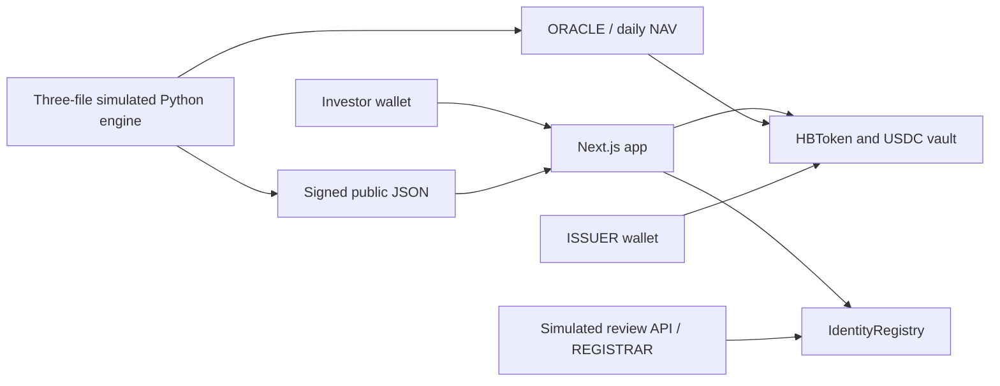

# HitBite Testnet v2

[](https://github.com/artuntan/hitbite-mvp/actions/workflows/ci.yml)

A testnet reference implementation of subscriptions, redemptions and coupon pass-through for simulated Türkiye USD sovereign-bond fund units.

**[Open the live app](https://hitbite-testnet-v2.vercel.app/app)** · [Transparency](https://hitbite-testnet-v2.vercel.app/transparency) · [Generated live-test STATUS](STATUS.md) · [Deployment receipts](deployments/arc-testnet.json)

> Testnet. Simulated portfolio. Not an offer of securities.

## Try it in five minutes

1. Install a browser wallet, or open the app inside your mobile wallet's browser. Request test **USDC** from the [Circle faucet](https://faucet.circle.com): choose **Arc Testnet** and enter your public wallet address. Never enter a private key into the app or faucet.
2. [Open the app](https://hitbite-testnet-v2.vercel.app/app), connect your wallet, then use **Add / switch to Arc Testnet** if needed. Chain ID: **5042002**. RPC: `https://rpc.testnet.arc.io`. Gas on Arc is paid in USDC. Keep a small balance for fees.
3. Choose **Verify**. Enter your name and country and confirm professional-investor status. Sign the eligibility statement, wait for the ten-second simulated review and the registrar's receipt. This is a simulation, not real KYC. Not available to residents of the United States or Türkiye on this testnet.
4. Choose **Subscribe**, enter a small amount such as **1 USDC**, then sign **Approve USDC** and **Subscribe** separately. The first permits that exact amount; the second exchanges it for hbTRS at the NAV in effect when the transaction executes. The UI reserves at least 0.05 USDC for gas.
5. Choose **Hold** to inspect your position and receipts. Coupons are claimable only after an issuer funds a distribution; the app does not fabricate a payout. Choose **Redeem**, use your token balance or a smaller amount, and sign to receive USDC from the vault. Existing accrued coupons remain claimable after redemption.

Turn on **Walkthrough** in the header for plain-language explanations. It is off initially and remembered in your browser. Each write shows **What will happen → Sign → Receipt**, including the transaction hash, block and emitted events. If confirmation is delayed, inspect the pending transaction before retrying.

Redemptions on the testnet are paid from a vault the admin funds. There is no liquidity guarantee.

The app currently supports injected browser wallets. WalletConnect QR pairing is optional and requires a configured public project ID; it is not represented as tested here. The app contains only four product routes: Overview, the five-step app, Transparency and role-restricted Admin.

## What is simulated

No real bonds are held, no real investor funds are accepted, and hbTRS has no claim on a real security. The portfolio contains model holdings named TURKEY 6.0% 2029, TURKEY 6.65% 2034 and TURKEY 7.04% 2036, with target weights of 40% / 40% / 20%. Their identifiers, coupon schedules, prices and valuations are explicitly simulated. There are no real ISINs, audit claims or partner endorsements.

The reference basket has 100,000 units. Its dirty prices, retained simulated coupon cash and accrued fees determine a reference price per unit. Holdings are scaled to the **actual on-chain token supply at a recorded block**. Subscriptions therefore cannot mechanically dilute the simulated NAV. Faucet-funded vault cash is reported separately and is never added to the simulated bond value.

- Clean prices are manual inputs with visible source/date fields. They carry forward until revised; daily NAV publication does not make these market quotes fresh.
- Bond accrued interest uses declared semiannual Actual/Actual periods. Simulated bond coupons received since purchase remain in model cash, preventing a discontinuity at a coupon date.
- Fees accrue on the fixed reference units at 0.75% management plus 0.30% simulated expenses per year, Actual/365. They are model expenses, not a cash subscription fee; subscription fees are zero.
- NAV is floored to six USDC decimals. Token quantities use 18 decimals. At zero supply, the reference price remains available but the backing ratio is undefined and the snapshot says `bootstrap`.
- Simulated yield to maturity is computed from discounted model cash flows. The simulated trailing 30-day distribution yield uses actual funded coupon-index increments divided by current NAV and is **not annualized**. These figures appear only on Transparency.
- On-chain coupons are independently funded by the issuer. They do not silently reduce NAV. Unpaid coupons, including rounding dust, are reserved from redeemable vault liquidity.
- Simulated attestor. Replaced by an independent firm in production. An EIP-191 signature authenticates the exact historical JSON payload against the configured public signer; it is not evidence of real custody or independent review.

## Contracts and public records

| Contract | Arc Testnet address |
|---|---|
| IdentityRegistry | [0xd8c5d0473d11de3177a68182b91213171d8e4580](https://explorer.testnet.arc.io/address/0xd8c5d0473d11de3177a68182b91213171d8e4580) |
| HBToken / hbTRS | [0x6d5163d237203af9bce4292562b94e585327927e](https://explorer.testnet.arc.io/address/0x6d5163d237203af9bce4292562b94e585327927e) |
| Native USDC ERC-20 interface | [0x3600000000000000000000000000000000000000](https://explorer.testnet.arc.io/address/0x3600000000000000000000000000000000000000) |

Both application contracts are explorer-verified. [Standard JSON inputs and compiler metadata](deployments/verification/) are also committed. Deployment block: **63061198**. Initial issuer vault seed: **10 testnet USDC**; its receipt is in [the deployment artifact](deployments/arc-testnet.json). Subsequent balances and distributions are on-chain and visible in Transparency/Admin.

Arc's native gas balance uses 18 decimals, while its USDC ERC-20 interface uses **6**; these are two interfaces to the same asset. The UI shows one USDC balance. Every transaction sets an EIP-1559 maximum fee of at least 20 gwei. There is no MockUSDC on Arc.

## Architecture and ownership



`IdentityRegistry` enforces the current country blocklist and wallet eligibility. Transfers require both sender and receiver to be verified. Revoked or newly blocked holders can still redeem existing tokens and claim previously earned coupons while unpaused. They cannot receive or subscribe, and the public API cannot restore a revoked record. An authorized registrar must review it.

`HBToken` enforces issuer/oracle roles, a 5% per-update NAV movement rail, subscription/redemption math and indexed coupon accrual. Issuers can explicitly force a NAV update. Pausing blocks subscriptions, redemptions, transfers, claims and coupon distributions. A manual NAV change can make the published JSON differ; rerun the NAV pipeline after review.

The registrar API uses a server-authenticated five-minute challenge bound to the wallet, country, professional consent, origin and chain. It checks a wallet signature and a minimum ten-second review before sending `addVerified`. Names are hashed and not retained or put on-chain. Confirmed registry state is the durable eligibility record. A per-instance signer queue and pending-chain nonce handling make conflicts retriable; production-scale distributed abuse prevention is outside this simulated registrar.

HitBite owns this reference behavior, application and transparency pipeline. The intended production issuance, custody, compliance, fund accounting and audited token implementation are provided through the licensed partner model below. This table describes an intended operating model, not an existing regulated issuance or partnership.

| Layer | Testnet v2 | Production (first issuance) |
|---|---|---|
| Legal issuer | none (simulation) | Licensed ADGM fund manager's fund |
| KYC / whitelist | 10-second simulated review | Partner's KYC vendor writes to the registry |
| Money | testnet USDC on Arc | Fiat/USDC into the fund's account via the partner |
| Custody | none | Bonds at broker/Euroclear; tokens with a licensed digital custodian |
| Token contract | ours | Vendor's audited contract implementing this behaviour |
| NAV | our Python job | Fund administrator's NAV, published by us |
| Attestation | simulated signer | Independent firm, monthly |
| App and transparency | ours | ours, fronting the partner's flow |

## Run locally

Requirements: Node 22+, pnpm 10.22.0, Foundry 1.8.1, Python 3.11 and uv. Font assets are self-hosted; no font service is required at runtime.

```sh
pnpm install --frozen-lockfile
git submodule update --init --recursive
cp .env.example .env
pnpm dev
```

The public Arc deployment is the default. Add the **public** attestor address `0x60Be08C7e2dA3b9C1fe2955d237b8833C2D63254` to `NEXT_PUBLIC_ATTESTOR_ADDRESS`. Viewing requires no private keys. Local simulated verification additionally requires an authorized funded `REGISTRAR_PRIVATE_KEY` and a random `VERIFICATION_SECRET` of at least 32 characters. Set `NEXT_PUBLIC_APP_URL` to the exact origin serving the app. Keep all keys in the ignored `.env`; never commit or paste them into chat.

```sh
pnpm check                              # lint, safety checks, types, tests, build
forge test --root contracts              # unit, fuzz and stateful invariants
uv run --python 3.11 --no-project python -m unittest discover -s tests/nav -v
uv tool run ruff==0.16.6 check nav_engine/hb.py tests/nav
pnpm nav nav --dry-run                   # deterministic fixture; no signer/RPC/writes
pnpm smoke                              # read-only RPC, contracts, live routes, NAV and signature
pnpm check:secrets                       # requires gitleaks 8.30.1
```

`NEXT_PUBLIC_CHAIN` allows only `arc-testnet`, `base-sepolia` or `local`. The configuration, deployment tool and runtime check RPC chain IDs. Selecting a fallback does not manufacture a deployment; deploy it and sync the manifest first. Only Base Sepolia/local may deploy MockUSDC. No mainnet configuration exists.

## Operator commands

Use funded, separate, testnet-only role keys. `.env.example` documents every setting.

```sh
pnpm run deploy --chain arc-testnet --dry-run
pnpm run deploy --chain arc-testnet      # refuses to overwrite a confirmed deployment
pnpm verify:contracts --chain arc-testnet
pnpm fund:vault --chain arc-testnet --amount 10
pnpm sync:contracts
pnpm exec tsx scripts/cast-subscribe.ts  # real 0.5-USDC deployer subscription; not read-only

pnpm nav nav
pnpm nav push --dry-run
pnpm nav push
pnpm nav attest
```

`pnpm run deploy` uses `run` intentionally: plain `pnpm deploy` is pnpm's own workspace command. The cast wrapper signs only in memory and passes only the public signed transaction to `cast publish`; keys never enter argv. Contract ABIs and the application deployment manifest are generated with `pnpm sync:contracts`.

The [daily NAV workflow](.github/workflows/nav.yml) runs at 07:00 UTC, publishes with the oracle, signs with the simulated attestor and commits confirmed JSON. It needs GitHub secrets `ORACLE_PRIVATE_KEY`, `ATTESTOR_PRIVATE_KEY` and repository variable `NEXT_PUBLIC_ATTESTOR_ADDRESS`. It runs on the default branch. A dedicated `VERCEL_DEPLOY_HOOK` secret and `NEXT_PUBLIC_APP_URL` repository variable trigger a production rebuild and verify that the live site serves the new publication. Manual prices must be reviewed separately. Monthly coupon automation is not enabled; the issuer funds distributions explicitly in Admin.

The Vercel project uses `app/` as its root with parent workspace files included. Build with `pnpm build`, install with `pnpm install --frozen-lockfile`, Node 22. The only server credentials required there are `REGISTRAR_PRIVATE_KEY` and `VERIFICATION_SECRET`; do not upload issuer/oracle/attestor/E2E keys. Set public chain, app URL and expected attestor as documented. `.vercelignore` excludes local credentials and archived work.

## Reproduce the live acceptance run

`pnpm e2e` makes real testnet transactions. Configure two **fresh, distinct** funded wallets in `E2E_WALLET_A_PRIVATE_KEY` and `E2E_WALLET_B_PRIVATE_KEY`, plus the authorized issuer/registrar keys. The default is 1 USDC per subscription and 0.2 USDC total coupon funding. Each investor needs additional USDC for gas. Set `E2E_BASE_URL` to the live app origin.

For browser evidence, configure a separate funded `UI_WALLET_PRIVATE_KEY` and run:

```sh
pnpm exec playwright install chromium
pnpm test:ui
pnpm e2e
```

The browser test injects a test provider while keeping signing keys in the Node process. It performs actual API and Arc transactions and saves screenshots under `.context/`. It is not a substitute for a founder personally testing a real wallet extension. The E2E runner requires recent browser evidence, recorded founder acceptance and green CI for its exact source commit before touching the fresh investor wallets. It then verifies both wallets through the live API, approves/subscribes, distributes/claims coupons, redeems, checks restrictions, pauses and restores the token. It generates `STATUS.md` and public receipt evidence; failures remain visible. Rerunning a fresh-wallet acceptance run requires new wallet keys/funding.

After the founder explicitly confirms their own complete fresh-wallet flow, record the confirmation in `.context/founder-acceptance.json` with `confirmed: true`, an ISO `timestamp`, the exact `baseUrl`, and the actual `source`, `statement` and `scope`. The current confirmation is preserved in [the public acceptance record](deployments/evidence/founder-acceptance.json); for a repeat run against the same deployment, copy that record to the local path. Do not manufacture a confirmation for a new deployment. The runner copies its provenance into the generated evidence separately from automated test results.

`pnpm smoke` performs no transactions and never edits STATUS. Only `pnpm e2e` writes STATUS. [PROGRESS.md](PROGRESS.md) is the append-only implementation/evidence log; [PLAN.md](PLAN.md) records approved decisions and dated amendments. Founder acceptance is explicitly separate from automated checks.

## Preserved v1

The original Base Sepolia implementation remains on [`v1-base-sepolia`](https://github.com/artuntan/hitbite-mvp/tree/v1-base-sepolia) and tag [`v1`](https://github.com/artuntan/hitbite-mvp/tree/v1), at commit `2fc8f9e75229ceca4a7347ffd089e76185030c16`. The v2 app was rebuilt from the supplied [design source](design.md).

Not an offer of securities. Testnet only.
