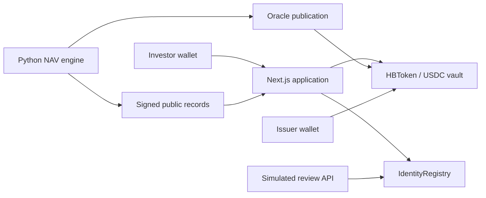

# HitBite · Arc Testnet

[](https://github.com/artuntan/hitbite-mvp/actions/workflows/ci.yml)
[](LICENSE)

An open-source implementation of USDC subscriptions, coupon distributions and redemptions for **hbTRS**, representing simulated Türkiye USD sovereign-bond fund units on Arc Testnet.

**[Open the app](https://hitbite.markets/app)** · **[Transparency](https://hitbite.markets/transparency)** · **[Verify the implementation](docs/verification.md)** · **[Security policy](SECURITY.md)**

> **Testnet only.** No real bonds are held and hbTRS provides no claim on a real security. Eligibility review and portfolio valuations are simulated. This implementation has **not received an independent security audit**. Source verification and automated tests are not an audit or a guarantee. Not an offer of securities.

## What you can verify

| Capability | Implementation | Public evidence |
|---|---|---|
| Wallet eligibility and transfer restrictions | [IdentityRegistry](contracts/src/IdentityRegistry.sol) | [Verified registry source](https://explorer.testnet.arc.io/address/0xd8c5d0473d11de3177a68182b91213171d8e4580#code) |
| USDC subscription and redemption | [HBToken](contracts/src/HBToken.sol) | [Verified token source](https://explorer.testnet.arc.io/address/0x6d5163d237203af9bce4292562b94e585327927e#code) |
| Coupon accrual and reserved liquidity | [Contract tests](contracts/test/) | [Dated transaction acceptance](STATUS.md), [receipts](deployments/evidence/e2e.json) |
| Daily simulated NAV and signed records | [Python engine](nav_engine/hb.py), [model](docs/nav-model.md) | [Published NAV](https://hitbite.markets/data/nav.json), [attestation](https://hitbite.markets/data/attestation.json) |
| Reproducible builds and checks | [CI workflow](.github/workflows/ci.yml) | [Run history](https://github.com/artuntan/hitbite-mvp/actions/workflows/ci.yml) |

Evidence has a date and scope. Historical acceptance records are preserved; they are not presented as fresh tests of every later change. [Verification notes](docs/verification.md) explain reproduction and limitations.

## Try the public testnet

1. Request test USDC from the [Circle faucet](https://faucet.circle.com), choosing **Arc Testnet**. Use an injected browser wallet or your wallet's mobile browser.
2. [Open the app](https://hitbite.markets/app), connect, and switch to Arc Testnet (**5042002**). Keep USDC available for gas.
3. Complete the eligibility form, sign its statement and wait for the ten-second simulated review. This testnet excludes US and Türkiye residents and requires professional-investor confirmation; this is not real KYC.
4. Approve an exact USDC amount and subscribe to hbTRS. Coupons become claimable only after an issuer funds a distribution. Redeem from the portfolio workspace when the contract is unpaused and the vault has sufficient liquidity.

Public access requires no invitation. Test tokens have no promised value or guaranteed liquidity. Never enter a private key or seed phrase into the app.

## How it works



Contracts enforce eligibility, accounting and role permissions on-chain. The app reads contract state and signs investor transactions through the user's wallet. The registrar API registers eligible test wallets. The NAV engine values a declared simulated basket and publishes its receipt and attestation through a checked PR.

**Operator control is explicit:** the administrator manages roles; the issuer can mint/burn, pause activity and override NAV; the registrar controls eligibility. Deployed roles use individual testnet keys, with no multisig or timelock. [Read the trust model](docs/security-model.md) before interpreting the evidence.

## Run locally

Use Node from [`.nvmrc`](.nvmrc), pnpm **10.22.0**, Python **3.11**, uv and Foundry **1.8.1** for contract tests.

```sh
git clone --recurse-submodules https://github.com/artuntan/hitbite-mvp.git
cd hitbite-mvp
pnpm install --frozen-lockfile
cp .env.example .env
pnpm dev
```

Viewing the public deployment requires no private keys. Configure the public attestor address using [operations](docs/operations.md) to verify signed records locally. Local verification needs a funded, authorized registrar key and a random ticket secret. Keep them in the ignored `.env`; never use real-fund wallets. Preview deployments intentionally have no registrar credentials.

```sh
pnpm check                       # lint, security/config tests, types, build
forge test --root contracts       # unit, fuzz and invariant tests
uv run --python 3.11 --no-project python -m unittest discover -s tests/nav -v
python3 -m unittest discover -s tests/automation -v
pnpm nav nav --dry-run            # deterministic; no RPC, signing or writes
pnpm check:secrets                # requires gitleaks 8.30.1
pnpm smoke                       # read-only deployment checks
```

## Repository guide

| Path | Purpose |
|---|---|
| [`app/`](app/) | Next.js app, investor workspace, Transparency and review API |
| [`contracts/`](contracts/) | Solidity contracts and Foundry tests |
| [`packages/config/`](packages/config/) | Chain configuration, generated ABIs and addresses |
| [`nav_engine/`](nav_engine/) | Simulated portfolio inputs, valuation and signing |
| [`deployments/`](deployments/) | Deployment/compiler records and dated public evidence |
| [`tests/`](tests/), [`scripts/`](scripts/) | Checks, deployment tools and acceptance runners |

[Verification](docs/verification.md) · [Security model](docs/security-model.md) · [NAV model](docs/nav-model.md) · [Operations](docs/operations.md) · [Contributing](CONTRIBUTING.md)

The earlier Base Sepolia implementation is preserved at [tag `v1`](https://github.com/artuntan/hitbite-mvp/tree/v1); `main` contains Arc Testnet v2. [PLAN](PLAN.md) and the append-only [PROGRESS](PROGRESS.md) log retain implementation history. Available under the [MIT license](LICENSE).
