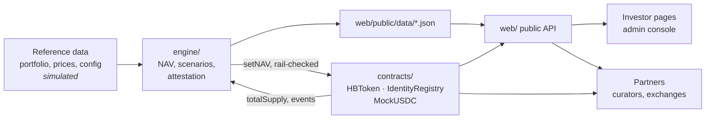

# HitBite MVP — Türkiye USD sovereign bonds, on-chain (testnet reference implementation)

> **Testnet demonstration on Base Sepolia. Simulated portfolio and attestation. Not an offer of securities.**

[](https://github.com/artuntan/hitbite-mvp/actions/workflows/ci.yml)

`hbTRS` is a whitelisted token representing a simulated, custodied portfolio of Türkiye USD sovereign bonds. Subscriptions and redemptions settle at net asset value in test USDC; coupons are passed through pro-rata. In production the fund is issued and managed by a licensed fund manager; HitBite designs the product, runs the data and transparency layers, and builds distribution.

### Live demo, recording and addresses

| | |
|---|---|
| **Live demo** | _Awaiting the founders' Vercel project (PLAN.md D16). Run it locally with `make dev`._ |
| **90-second recording** | _Awaiting the founders' recording._ |
| **Contract addresses** | Base Sepolia deployment awaits a funded deployer key (PLAN.md Section 5). Deploy with `make deploy CHAIN=base-sepolia`, then `make verify` for Basescan. |
| **Local addresses** | `contracts/deployments/anvil.json` — deterministic on a fresh Anvil, and committed. |

Nothing above is a placeholder for something that exists; each is an item that genuinely needs a
credential this repository does not have. `PROGRESS.md` keeps the current list under *Needs from
founders*.

## What is real vs. simulated

Read this before anything else on the page. Everything in the middle column is what this repository
actually does today.

| | This MVP | Production |
|---|---|---|
| Legal issuer | None | Licensed ADGM fund manager |
| KYC | Auto-approved on testnet by a simulated registrar | The partner's KYC vendor |
| Money | `MockUSDC`, a test token with a faucet | Fiat or USDC to the fund's account |
| Custody | None. The portfolio is simulated | Broker-Euroclear and a licensed digital custodian |
| Token contract | Ours, tested and analysed, **not audited** | The vendor's audited implementation of this spec |
| NAV | Our engine, from illustrative prices | The fund administrator's NAV |
| Attestation | Simulated signer, labelled as such | An independent firm, monthly |
| Dashboard and transparency | Ours | Ours |

The bond positions are illustrative placeholders whose coupons and maturities were chosen to match
the yield levels observed on the Türkiye USD curve on 31 August 2026. Their ISINs are marked `TBD`
rather than invented. No audit, licence, partnership or endorsement is claimed anywhere in this
repository.

## Documentation

| Document | What it answers |
|---|---|
| [`ARCHITECTURE.md`](ARCHITECTURE.md) | How the engine, contracts and web app fit together, with sequence diagrams |
| [`COMPLIANCE_RULES.md`](COMPLIANCE_RULES.md) | Every rule the contracts enforce: whitelist, blocked countries, transfers, pause, NAV rail |
| [`RISKS.md`](RISKS.md) | What can go wrong, in plain language, starting with what is simulated |
| [`SECURITY.md`](SECURITY.md) | Threat model, the triaged static-analysis findings, and what is *not* mitigated |
| [`PARTNER_INTEGRATION.md`](PARTNER_INTEGRATION.md) | For a vault curator or listing team: reading NAV, transfer rules, attestations, collateral pricing |
| [`SPEC.md`](SPEC.md) | The product spec |
| [`PLAN.md`](PLAN.md) | Phases, and every ambiguity resolved as a numbered decision |
| [`PROGRESS.md`](PROGRESS.md) | Dated build log: what shipped, what broke, what is blocked |

## Architecture

The full picture, with sequence diagrams for subscribe, coupon and redeem, is in
[`ARCHITECTURE.md`](ARCHITECTURE.md).



The engine reads the chain and the chain reads the engine. That loop is why the number on the
transparency page can be checked against the contract rather than taken on trust, and the page
performs exactly that check in public.

## Quickstart

```bash
make setup     # submodules, uv, pnpm, playwright
make lint      # forge fmt, ruff, mypy, eslint, prettier, tsc, secret scan
make test      # forge test, pytest, vitest, next build, playwright smoke
make dev       # the web app on http://localhost:3000
```

To run the whole thing locally against a chain, in two terminals:

```bash
make anvil                      # terminal 1: a local node on 127.0.0.1:8545
make deploy-local && make seed  # terminal 2: deploy, verify two demo wallets, set the opening NAV
make nav                        # compute NAV into web/public/data/
make dev                        # the app, now reading a live chain
```

Copy `.env.example` to `.env` (root) and `web/.env.local` (web). Every variable is documented there.
Leave every key empty unless you are deploying to Base Sepolia; the local flow needs none, because
Anvil's accounts are unlocked.

## What HitBite owns, and what a licensed partner runs

| | Who runs it in production |
|---|---|
| Product design, the data and transparency layers, distribution | **HitBite** |
| The token contract | A licensed vendor's audited implementation of this spec |
| Fund issuance, management and NAV | A licensed fund manager and its administrator (ADGM) |
| Identity verification | The partner's KYC vendor, writing to the same registry |
| Custody | A broker through Euroclear, and a licensed digital custodian |
| Attestation | An independent firm, monthly |

This repository is the reference implementation of the parts in the first row, plus a working model
of everything else so the design can be evaluated end to end.

## Team

_Two founders, one line each — awaiting their copy._

## Layout

| Path | What |
|---|---|
| `contracts/` | Foundry: `IdentityRegistry`, `HBToken` (`hbTRS`), `MockUSDC` |
| `engine/` | Python 3.11: NAV, attestation, oracle push |
| `web/` | Next.js app: investor pages, admin console, public JSON API |
| `demo/` | End-to-end testnet scenario runner and `REPORT.md` |
| `notebooks/` | Portfolio analytics notebook and exported figures |
| `docs/` | Screenshots, diagrams, figures |

## How to check this yourself

A reviewer should not have to take any of it on trust. The three checks that matter most:

```bash
# 1. The published NAV and the contract's NAV are the same integer.
cast call $HB_TOKEN "nav()(uint256)" --rpc-url $RPC
jq '.data.nav.usdc_6dec' < web/public/data/nav.json

# 2. The attestation signature verifies. No attestation is committed — signing needs the
#    attestor key (PLAN.md D34) — so produce one first, then verify it without a key.
ATTESTOR_PRIVATE_KEY=0x... make attest
make attest-verify

# 3. The tests are the spec. Coverage on contracts/src is 100% of lines,
#    statements, branches and functions.
make test
cd contracts && forge coverage --no-match-coverage script
```

`SECURITY.md` lists what is **not** mitigated as plainly as what is, and states that no audit has
been performed. `RISKS.md` opens with what is simulated before it discusses any bond risk.

## Disclaimer

This is a technical demonstration on a public test network. Portfolio data, prices and attestations are simulated or illustrative and are labelled as such. Nothing here is an offer, solicitation or recommendation to buy any security. HitBite is not a licensed financial institution.

## Licence

MIT — see [`LICENSE`](LICENSE).
